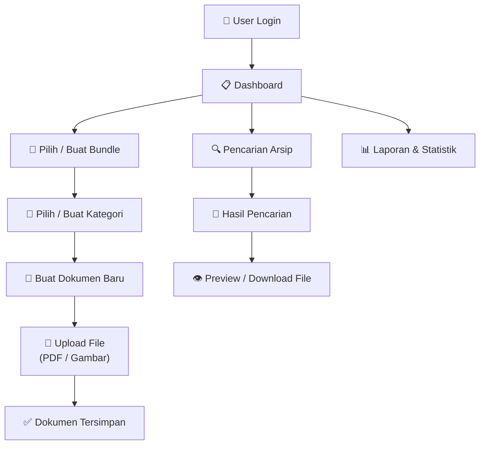
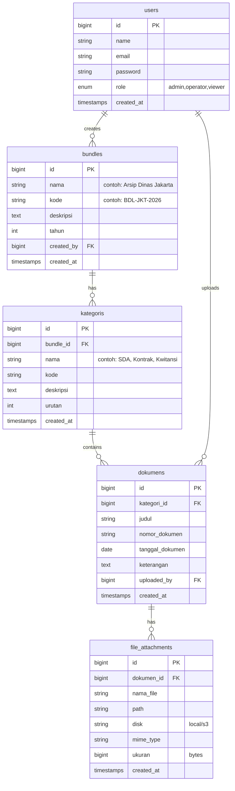

# E-Arsip — Aplikasi Elektronik Arsip (Laravel 12 + Volt)

Membangun aplikasi manajemen arsip digital yang mampu menyimpan, mengelompokkan, dan mengelola dokumen (PDF, gambar) dalam struktur **Bundle → Sub-File → File Attachment**.

---

## Konsep Utama & Terminologi

| Istilah | Penjelasan |
|---------|-----------|
| **Bundle** | Kumpulan arsip milik satu instansi/dinas, contoh: *"Arsip Dinas Jakarta 2026"* |
| **Kategori** | Pengelompokan sub-file dalam bundle, contoh: *SDA, Kontrak, Kwitansi* |
| **Dokumen** | Satu entri dokumen di dalam kategori, memiliki metadata (judul, nomor, tanggal) |
| **File Attachment** | File fisik (PDF/gambar) yang dilampirkan ke dokumen |

---

## Alur Kerja (Workflow)



### Detail Alur:

1. **Login** — User masuk dengan email/password (role-based: Admin, Operator, Viewer)
2. **Dashboard** — Melihat ringkasan: total bundle, total dokumen, upload terbaru
3. **Kelola Bundle** — Buat/edit/hapus bundle arsip (contoh: "Dinas Jakarta 2026")
4. **Kelola Kategori** — Di dalam bundle, buat kategori (SDA, Kontrak, Kwitansi, dll)
5. **Upload Dokumen** — Di dalam kategori, buat dokumen baru + upload file (multi-upload)
6. **Preview & Download** — Lihat preview file (PDF viewer / image viewer) langsung di browser
7. **Pencarian** — Cari dokumen berdasarkan judul, nomor, kategori, bundle, tanggal
8. **Laporan** — Statistik arsip per bundle, per kategori, per periode

---

## Database Design (ERD)



---

## Tech Stack

| Layer | Teknologi |
|-------|-----------|
| **Framework** | Laravel 12 |
| **Frontend** | Volt (Livewire v3 single-file components) |
| **Styling** | Tailwind CSS 4 (bawaan Laravel 12) |
| **Database** | MySQL / MariaDB |
| **File Storage** | Laravel Storage (local disk, bisa upgrade ke S3) |
| **Auth** | Laravel Breeze / Starter Kit dengan Volt |
| **PDF Preview** | PDF.js (embedded viewer) |
| **Image Preview** | Lightbox / Modal viewer |

---

## Struktur File Storage

```
storage/app/private/arsip/
├── bundle-1/              ← Arsip Dinas Jakarta
│   ├── sda/               ← Kategori SDA
│   │   ├── dok-001.pdf
│   │   └── dok-002.jpg
│   ├── kontrak/           ← Kategori Kontrak
│   │   ├── dok-003.pdf
│   │   └── dok-004.pdf
│   └── kwitansi/          ← Kategori Kwitansi
│       └── dok-005.pdf
├── bundle-2/
│   └── ...
```

> [!IMPORTANT]
> File disimpan di `storage/app/private/` agar **tidak bisa diakses publik**. Akses file melalui route khusus yang dilindungi middleware auth.

---

## Proposed Changes

### 1. Instalasi & Setup Awal

#### [NEW] Laravel Project
```bash
composer create-project laravel/laravel e-arsip
cd e-arsip
composer require livewire/volt
php artisan volt:install
```

---

### 2. Database — Migrations

#### [NEW] `database/migrations/xxxx_create_bundles_table.php`
```php
Schema::create('bundles', function (Blueprint $table) {
    $table->id();
    $table->string('nama');
    $table->string('kode')->unique();
    $table->text('deskripsi')->nullable();
    $table->year('tahun');
    $table->foreignId('created_by')->constrained('users');
    $table->timestamps();
    $table->softDeletes();
});
```

#### [NEW] `database/migrations/xxxx_create_kategoris_table.php`
```php
Schema::create('kategoris', function (Blueprint $table) {
    $table->id();
    $table->foreignId('bundle_id')->constrained()->cascadeOnDelete();
    $table->string('nama');
    $table->string('kode')->nullable();
    $table->text('deskripsi')->nullable();
    $table->integer('urutan')->default(0);
    $table->timestamps();
});
```

#### [NEW] `database/migrations/xxxx_create_dokumens_table.php`
```php
Schema::create('dokumens', function (Blueprint $table) {
    $table->id();
    $table->foreignId('kategori_id')->constrained()->cascadeOnDelete();
    $table->string('judul');
    $table->string('nomor_dokumen')->nullable();
    $table->date('tanggal_dokumen')->nullable();
    $table->text('keterangan')->nullable();
    $table->foreignId('uploaded_by')->constrained('users');
    $table->timestamps();
    $table->softDeletes();
});
```

#### [NEW] `database/migrations/xxxx_create_file_attachments_table.php`
```php
Schema::create('file_attachments', function (Blueprint $table) {
    $table->id();
    $table->foreignId('dokumen_id')->constrained()->cascadeOnDelete();
    $table->string('nama_file');
    $table->string('path');
    $table->string('disk')->default('local');
    $table->string('mime_type');
    $table->unsignedBigInteger('ukuran'); // bytes
    $table->timestamps();
});
```

#### [MODIFY] `database/migrations/xxxx_create_users_table.php`
Tambahkan kolom `role`:
```php
$table->enum('role', ['admin', 'operator', 'viewer'])->default('operator');
```

---

### 3. Models — Eloquent

#### [NEW] `app/Models/Bundle.php`
- Relasi: `hasMany(Kategori)`, `belongsTo(User, 'created_by')`
- Scope: `scopeByTahun($query, $tahun)`

#### [NEW] `app/Models/Kategori.php`
- Relasi: `belongsTo(Bundle)`, `hasMany(Dokumen)`
- Accessor: `getDokumenCountAttribute()`

#### [NEW] `app/Models/Dokumen.php`
- Relasi: `belongsTo(Kategori)`, `hasMany(FileAttachment)`, `belongsTo(User, 'uploaded_by')`
- SoftDeletes

#### [NEW] `app/Models/FileAttachment.php`
- Relasi: `belongsTo(Dokumen)`
- Method: `getUrlAttribute()` → generate temporary signed URL
- Method: `getUkuranFormatAttribute()` → "2.5 MB"

---

### 4. Volt Pages (Single-File Components)

#### [NEW] `resources/views/pages/dashboard.blade.php`
- Statistik: total bundle, dokumen, file, storage used
- Tabel upload terbaru
- Chart per kategori (opsional)

#### [NEW] `resources/views/pages/bundles/index.blade.php`
- Daftar semua bundle (card grid / tabel)
- Pencarian & filter tahun
- Tombol buat bundle baru

#### [NEW] `resources/views/pages/bundles/show.blade.php`
- Detail bundle + daftar kategori
- Breadcrumb: Dashboard > Bundles > [Nama Bundle]
- Tombol tambah kategori

#### [NEW] `resources/views/pages/bundles/kategori/show.blade.php`
- Daftar dokumen dalam kategori
- Breadcrumb: Dashboard > Bundles > [Bundle] > [Kategori]
- Upload dokumen baru (form + file upload)

#### [NEW] `resources/views/pages/dokumen/show.blade.php`
- Detail dokumen + daftar file attachment
- Preview file (PDF.js / image modal)
- Download file

#### [NEW] `resources/views/pages/pencarian.blade.php`
- Full-text search dokumen
- Filter: bundle, kategori, tanggal range
- Hasil dengan highlight

---

### 5. File Upload & Storage

#### [NEW] `app/Http/Controllers/FileController.php`
```php
// Route untuk serve file (protected)
public function show(FileAttachment $file)
{
    $this->authorize('view', $file);
    
    return Storage::disk($file->disk)
        ->download($file->path, $file->nama_file);
}

// Route untuk preview (inline)
public function preview(FileAttachment $file)
{
    $this->authorize('view', $file);
    
    return Storage::disk($file->disk)
        ->response($file->path);
}
```

---

### 6. Middleware & Authorization

#### [NEW] `app/Policies/BundlePolicy.php`
- `viewAny`: semua role
- `create`: admin, operator  
- `update`: admin, operator (pemilik)
- `delete`: admin only

#### [NEW] `app/Policies/DokumenPolicy.php`
- `viewAny`: semua role
- `create`: admin, operator
- `delete`: admin only

---

### 7. Routes

#### [MODIFY] `routes/web.php`
```php
use App\Http\Controllers\FileController;

// Volt pages (auto-registered via Volt::route)
Volt::route('/dashboard', 'dashboard')->middleware('auth');
Volt::route('/bundles', 'bundles.index')->middleware('auth');
Volt::route('/bundles/{bundle}', 'bundles.show')->middleware('auth');
Volt::route('/bundles/{bundle}/kategori/{kategori}', 'bundles.kategori.show')->middleware('auth');
Volt::route('/dokumen/{dokumen}', 'dokumen.show')->middleware('auth');
Volt::route('/pencarian', 'pencarian')->middleware('auth');

// File access (protected)
Route::middleware('auth')->group(function () {
    Route::get('/file/{file}/download', [FileController::class, 'show'])->name('file.download');
    Route::get('/file/{file}/preview', [FileController::class, 'preview'])->name('file.preview');
});
```

---

## Contoh Implementasi Volt Component (Upload Dokumen)

```php
<?php
// resources/views/pages/bundles/kategori/show.blade.php

use Livewire\Volt\Component;
use Livewire\WithFileUploads;
use App\Models\Kategori;
use App\Models\Dokumen;
use App\Models\FileAttachment;

new class extends Component {
    use WithFileUploads;

    public Kategori $kategori;
    
    // Form fields
    public string $judul = '';
    public string $nomor_dokumen = '';
    public ?string $tanggal_dokumen = null;
    public string $keterangan = '';
    public array $files = [];

    public function mount(Kategori $kategori)
    {
        $this->kategori = $kategori->load('bundle', 'dokumens.fileAttachments');
    }

    public function simpanDokumen()
    {
        $this->validate([
            'judul' => 'required|string|max:255',
            'nomor_dokumen' => 'nullable|string|max:100',
            'tanggal_dokumen' => 'nullable|date',
            'files.*' => 'required|file|mimes:pdf,jpg,jpeg,png|max:10240', // max 10MB
        ]);

        $dokumen = Dokumen::create([
            'kategori_id' => $this->kategori->id,
            'judul' => $this->judul,
            'nomor_dokumen' => $this->nomor_dokumen,
            'tanggal_dokumen' => $this->tanggal_dokumen,
            'keterangan' => $this->keterangan,
            'uploaded_by' => auth()->id(),
        ]);

        foreach ($this->files as $file) {
            $path = $file->store(
                "arsip/{$this->kategori->bundle_id}/{$this->kategori->id}",
                'local'
            );

            FileAttachment::create([
                'dokumen_id' => $dokumen->id,
                'nama_file' => $file->getClientOriginalName(),
                'path' => $path,
                'disk' => 'local',
                'mime_type' => $file->getMimeType(),
                'ukuran' => $file->getSize(),
            ]);
        }

        $this->reset(['judul', 'nomor_dokumen', 'tanggal_dokumen', 'keterangan', 'files']);
        $this->kategori->load('dokumens.fileAttachments');
        
        session()->flash('success', 'Dokumen berhasil disimpan!');
    }
}; ?>

<div>
    {{-- Breadcrumb --}}
    <nav class="mb-6 text-sm text-gray-500">
        <a href="/dashboard">Dashboard</a> /
        <a href="/bundles">Bundles</a> /
        <a href="/bundles/{{ $kategori->bundle_id }}">{{ $kategori->bundle->nama }}</a> /
        <span class="text-gray-900 font-semibold">{{ $kategori->nama }}</span>
    </nav>

    {{-- Form Upload --}}
    <div class="bg-white rounded-xl shadow p-6 mb-8">
        <h2 class="text-lg font-bold mb-4">Upload Dokumen Baru</h2>
        
        <form wire:submit="simpanDokumen" class="space-y-4">
            <div>
                <label class="block text-sm font-medium">Judul Dokumen</label>
                <input type="text" wire:model="judul" class="w-full border rounded-lg px-3 py-2">
                @error('judul') <span class="text-red-500 text-sm">{{ $message }}</span> @enderror
            </div>

            <div class="grid grid-cols-2 gap-4">
                <div>
                    <label class="block text-sm font-medium">Nomor Dokumen</label>
                    <input type="text" wire:model="nomor_dokumen" class="w-full border rounded-lg px-3 py-2">
                </div>
                <div>
                    <label class="block text-sm font-medium">Tanggal Dokumen</label>
                    <input type="date" wire:model="tanggal_dokumen" class="w-full border rounded-lg px-3 py-2">
                </div>
            </div>

            <div>
                <label class="block text-sm font-medium">File (PDF / Gambar)</label>
                <input type="file" wire:model="files" multiple accept=".pdf,.jpg,.jpeg,.png"
                       class="w-full border rounded-lg px-3 py-2">
                @error('files.*') <span class="text-red-500 text-sm">{{ $message }}</span> @enderror
                
                {{-- Upload progress --}}
                <div wire:loading wire:target="files" class="text-blue-500 text-sm mt-1">
                    Uploading...
                </div>
            </div>

            <div>
                <label class="block text-sm font-medium">Keterangan</label>
                <textarea wire:model="keterangan" rows="3" class="w-full border rounded-lg px-3 py-2"></textarea>
            </div>

            <button type="submit" class="bg-blue-600 text-white px-6 py-2 rounded-lg hover:bg-blue-700">
                Simpan Dokumen
            </button>
        </form>
    </div>

    {{-- Daftar Dokumen --}}
    <div class="bg-white rounded-xl shadow p-6">
        <h2 class="text-lg font-bold mb-4">Daftar Dokumen</h2>
        
        @forelse($kategori->dokumens as $dokumen)
            <div class="border rounded-lg p-4 mb-3">
                <div class="flex justify-between items-start">
                    <div>
                        <h3 class="font-semibold">{{ $dokumen->judul }}</h3>
                        <p class="text-sm text-gray-500">
                            {{ $dokumen->nomor_dokumen }} · {{ $dokumen->tanggal_dokumen?->format('d M Y') }}
                        </p>
                    </div>
                    <a href="/dokumen/{{ $dokumen->id }}" class="text-blue-600 text-sm">Detail →</a>
                </div>
                
                {{-- File list --}}
                <div class="mt-3 flex flex-wrap gap-2">
                    @foreach($dokumen->fileAttachments as $file)
                        <a href="{{ route('file.preview', $file) }}" target="_blank"
                           class="inline-flex items-center gap-1 bg-gray-100 rounded px-2 py-1 text-xs">
                            @if(str_contains($file->mime_type, 'pdf'))
                                📄
                            @else
                                🖼️
                            @endif
                            {{ Str::limit($file->nama_file, 20) }}
                        </a>
                    @endforeach
                </div>
            </div>
        @empty
            <p class="text-gray-400 text-center py-8">Belum ada dokumen</p>
        @endforelse
    </div>
</div>
```

---

## User Review Required

> [!IMPORTANT]
> **Pilihan Starter Kit**: Laravel 12 menyediakan beberapa starter kit (Breeze, Jetstream). Apakah Anda ingin menggunakan **Laravel Breeze dengan Livewire/Volt** sebagai base auth? Atau mau auth custom?

> [!IMPORTANT]
> **Styling**: Laravel 12 default menggunakan **Tailwind CSS**. Apakah ini sesuai preferensi Anda, atau ingin menggunakan Bootstrap?

---

## Open Questions

> [!NOTE]
> 1. **Multi-tenant?** — Apakah aplikasi ini akan digunakan oleh beberapa dinas berbeda dengan data terpisah, atau satu instansi saja?
> 2. **Approval Workflow?** — Apakah perlu fitur *approval* (dokumen harus disetujui atasan sebelum final)?
> 3. **Versi Dokumen?** — Apakah perlu fitur *versioning* (menyimpan versi lama saat dokumen diupdate)?
> 4. **Batas Ukuran File?** — Berapa maksimal ukuran file per upload? (default: 10MB per file)
> 5. **Deployment** — Akan di-deploy di server sendiri atau cloud (cPanel, VPS, dll)?

---

## Verification Plan

### Automated Tests
```bash
php artisan test                           # Unit & Feature tests
php artisan migrate:fresh --seed           # Test migration & seeder
```

### Manual Verification
- [ ] Login dengan role admin, operator, viewer — pastikan akses sesuai
- [ ] Buat bundle → tambah kategori → upload dokumen → preview file
- [ ] Test upload file PDF dan gambar (JPG/PNG)
- [ ] Test pencarian dokumen
- [ ] Pastikan file tidak bisa diakses tanpa login (direct URL)
- [ ] Test soft delete dan restore dokumen
